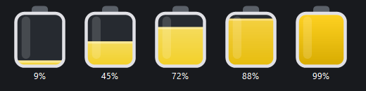

# ISS PISS-O-METER 🛰️🟡

A lightweight Windows **system-tray** gauge showing how full the International
Space Station's **urine tank** is, live, from NASA's public ISS telemetry feed.

The tray icon (right next to your clock) is a little piss tank that fills up
with amber liquid as the real tank fills. Click it for a big gauge with the
exact percentage and status.



## Run it

Double-click **`Start ISS PISS-O-METER.cmd`**, or from a terminal:

```powershell
pwsh -NoProfile -WindowStyle Hidden -File .\IssPissOMeter.ps1
```

A yellow tank icon appears in the notification area (you may need to click the
`^` overflow arrow and drag it next to the clock to keep it pinned).

- **Left-click** the icon → big gauge popup (Esc or click-away to dismiss).
- **Right-click** → menu: *Show gauge*, *Refresh now*, *Start with Windows*, *Exit*.

## What it shows

| Reading | Status            | Colour          |
|--------:|-------------------|-----------------|
| < 60 %  | NOMINAL           | green accent    |
| 60–80 % | FILLING UP        | amber           |
| 80–95 % | DUMP SOON         | orange          |
| ≥ 95 %  | CRITICAL – FLUSH! | red             |

The tooltip always shows the current percentage.

## How it works

- **Data source:** Lightstreamer streaming feed used by NASA's *ISS Mimic*
  project — server `push.lightstreamer.com`, adapter set `ISSLIVE`, telemetry
  item **`NODE3000005`** ("Urine Tank Qty", in percent). The value updates when
  the station is in signal; during loss-of-signal it holds the last reading.
- **Hosting:** The whole app (telemetry client + custom-drawn tray icon +
  popup) is written in C# but compiled **in-memory** at launch via PowerShell's
  `Add-Type`, and hosted by the Microsoft-signed `pwsh.exe`. There is **no
  compiled `.exe` on disk**, which is what lets it run under **Smart App
  Control** (which blocks unsigned binaries). No .NET SDK or NuGet packages
  required — it uses only the in-box runtime.

## Notes / limitations

- Because it rides on `pwsh.exe` + WinForms, resident memory is ~150–200 MB.
  A standalone compiled `.exe` would be far smaller (~20 KB + runtime), but
  Smart App Control blocks unsigned exes, so the script-hosted form is the
  trade-off that "just works" without weakening your security settings.
- The feed reports a percentage only; there's no separate "litres" figure.
- "Start with Windows" drops a small `IssPissOMeter.cmd` in your Startup folder;
  toggling it off deletes that file.
